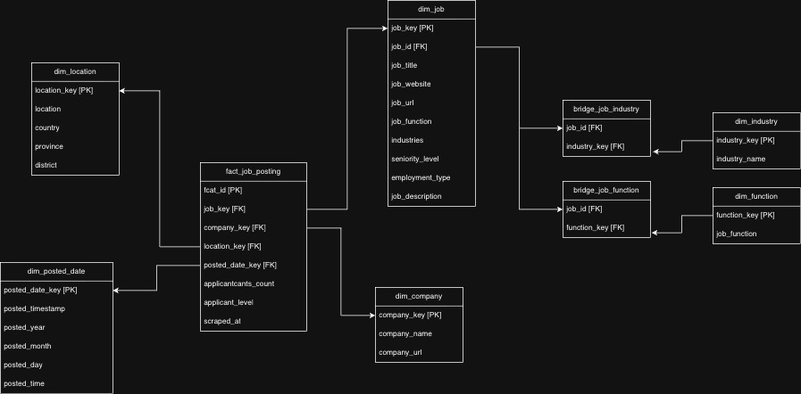

# 📊 End-to-End Data Pipeline for Job Market Analysis

This project demonstrates a production-style data engineering pipeline that collects, processes, and analyzes job market data using modern data stack tools such as Databricks, Apache Spark, Airflow, and dbt.

The pipeline automates the full lifecycle:
data extraction → storage → transformation → analytics-ready datasets

It is designed to showcase real-world data engineering practices including orchestration, scalable processing, and modular transformations.

### 🧱 Architecture Overview

```
Web Scraper → Raw Data → Data Lake (Databricks) → dbt Transformations → Analytics Tables
                         ↑
                     Airflow Orchestration
```

### ⚙️Tech Stack

Layer | Technology |
--- | --- |
Data Collection | Python Web Scraper |
Orchestration | Apache Airflow |
Processing Engine | Apache Spark (Databricks) |
Data Storage | Databricks Lakehouse |
Transformations | dbt core |
Environment | Docker |

### 📁 Project Structure

```

End-to-End-Data-Pipeline-for-Job-Market-Analysis
│
├── airflow/                # Airflow DAGs for orchestration
├── database/               # Database connection configs and utilities
├── databricks/             # Code in databricks notebooks for controlling jobs and transformations
├── scraper/                # Job scraping scripts
├── raw/                    # Raw collected data
├── dbt_job_market/         # dbt models and transformations
│
├── docker-compose.yaml     # Local development environment
├── requirements.txt        # Python dependencies
└── README.md
```

### 🔁 Airflow DAG Overview

```
scrape_jobs
    ↓
upload_to_databricks
    ↓
check_data_availability
    ↓
run_dbt_models
```

### 🚀 Getting Started

1. **Clone the Repository**
```bash
git clone https://github.com/Freewifi-100/End-to-End-Data-Pipeline-for-Job-Market-Analysis.git

cd End-to-End-Data-Pipeline-for-Job-Market-Analysis
```

2. **Start local services**

```bash
docker-compose up -d
``` 

3. **Run the pipeline**

- From Airflow UI ``http://localhost:8080``
- Trigger the `job_market_data_pipeline` DAG

### Database Schema style


